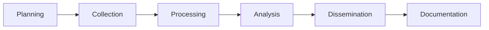

# 🔍 OSINT Portfolio


Welcome to my Open Source Intelligence (OSINT) portfolio. This repository showcases my investigative work, methodology, and skills in gathering and analyzing publicly available information for security research and threat intelligence purposes.

---

## 📖 About OSINT

**Open Source Intelligence (OSINT)** refers to the collection and analysis of information gathered from publicly available sources. In cybersecurity, OSINT is crucial for:

- 🎯 Threat Intelligence & Actor Profiling
- 🔐 Security Assessments & Penetration Testing
- 🕵️ Digital Forensics & Incident Response
- 🌐 Cyber Threat Hunting
- 📊 Risk Assessment & Due Diligence

This portfolio demonstrates practical application of OSINT techniques in real-world scenarios through educational challenges and investigations.

---

## 🎯 My Approach

### Core Principles

```
Ethical → Systematic → Documented → Legal
```

- **Ethical Practice:** All investigations conducted within legal boundaries
- **Systematic Methodology:** Structured approach to information gathering
- **Comprehensive Documentation:** Detailed write-ups for reproducibility
- **Continuous Learning:** Staying updated with latest tools and techniques

### Investigation Workflow



---

## 🛠️ OSINT Toolkit

### Search & Discovery

| Tool | Purpose | Link |
|------|---------|------|
| **Google Dorks** | Advanced search queries | [Google](https://www.google.com) |
| **DuckDuckGo** | Privacy-focused search | [DuckDuckGo](https://duckduckgo.com) |
| **Shodan** | Internet-connected device search | [Shodan](https://www.shodan.io) |
| **Censys** | Internet infrastructure search | [Censys](https://censys.io) |
| **Hunter.io** | Email finder and verifier | [Hunter](https://hunter.io) |

### Social Media Intelligence

| Tool | Purpose | Link |
|------|---------|------|
| **Twint** | Twitter scraping | [GitHub](https://github.com/twintproject/twint) |
| **Social-Analyzer** | Social media profile finder | [GitHub](https://github.com/qeeqbox/social-analyzer) |
| **Sherlock** | Username search across platforms | [GitHub](https://github.com/sherlock-project/sherlock) |
| **Maltego** | Link analysis and data mining | [Maltego](https://www.maltego.com) |

### Domain & Network Analysis

| Tool | Purpose | Link |
|------|---------|------|
| **SecurityTrails** | DNS history and infrastructure | [SecurityTrails](https://securitytrails.com) |
| **VirusTotal** | URL/file malware analysis | [VirusTotal](https://www.virustotal.com) |
| **DNSDumpster** | DNS reconnaissance | [DNSDumpster](https://dnsdumpster.com) |
| **Whois** | Domain registration lookup | [Whois](https://who.is) |
| **URLScan.io** | Website scanner | [URLScan](https://urlscan.io) |

### Image & Media Analysis

| Tool | Purpose | Link |
|------|---------|------|
| **Google Reverse Image** | Image search | [Google Images](https://images.google.com) |
| **TinEye** | Reverse image search | [TinEye](https://tineye.com) |
| **ExifTool** | Metadata extraction | [ExifTool](https://exiftool.org) |
| **InVID** | Video verification | [InVID](https://www.invid-project.eu) |

### Data Processing & Decoding

| Tool | Purpose | Link |
|------|---------|------|
| **CyberChef** | Data transformation | [CyberChef](https://gchq.github.io/CyberChef/) |
| **Base64 Decode** | Encoding/decoding | Various online tools |
| **Papaparse** | CSV processing | [Papaparse](https://www.papaparse.com) |

### Frameworks & Aggregators

| Tool | Purpose | Link |
|------|---------|------|
| **OSINT Framework** | Comprehensive tool directory | [OSINT Framework](https://osintframework.com) |
| **Spiderfoot** | Automated OSINT collection | [GitHub](https://github.com/smicallef/spiderfoot) |
| **theHarvester** | Email, subdomain gathering | [GitHub](https://github.com/laramies/theHarvester) |
| **Recon-ng** | Web reconnaissance framework | [GitHub](https://github.com/lanmaster53/recon-ng) |

### Historical & Archive Data

| Tool | Purpose | Link |
|------|---------|------|
| **Wayback Machine** | Website history | [Archive.org](https://archive.org) |
| **Archive.today** | Webpage archiving | [Archive.today](https://archive.today) |

---

## 📁 Challenges & Write-ups

### Completed Investigations

| # | Challenge Name | Platform | Difficulty | Status | Link |
|---|---------------|----------|------------|--------|------|
| 1 | **Redhunt Investigation** | SecurityBlue Team | Easy | ✅ Completed (10/10) | [View Write-up](./SecurityBlue-Redhunt-Investigation/) |

---

## 🎓 Skills Demonstrated

Through these challenges, I've demonstrated proficiency in:

### Technical Skills
- ✅ Advanced search engine techniques (Google Dorking)
- ✅ Social media intelligence gathering (SOCMINT)
- ✅ DNS and domain analysis
- ✅ Data encoding/decoding (Base64, Hexadecimal, Binary)
- ✅ Metadata analysis and extraction
- ✅ Network infrastructure reconnaissance
- ✅ Digital footprint mapping
- ✅ Correlation analysis across multiple sources

### Analytical Skills
- ✅ Pattern recognition and data correlation
- ✅ Information validation and source verification
- ✅ Timeline construction
- ✅ Actor profiling and behavioral analysis
- ✅ Evidence documentation and chain of custody

### Soft Skills
- ✅ Systematic investigation methodology
- ✅ Detailed technical documentation
- ✅ Ethical decision-making
- ✅ Legal compliance awareness
- ✅ Critical thinking and problem-solving

---

## 📊 Statistics

```
Total Challenges Completed: 1
Perfect Scores: 1 (100%)
Tools Mastered: 15+
Techniques Applied: 20+
Hours of Investigation: 10+
```

---

## 🎯 Learning Path

### Current Focus
- Advanced DNS reconnaissance techniques
- Dark web intelligence gathering
- Geolocation and imagery intelligence (GEOINT)
- Automated OSINT workflows

### Certifications & Training
- 🎓 SecurityBlue Team - Introduction to OSINT ✅
- 🎯 Next: Advanced OSINT certifications

---

## 🤝 Contributing & Collaboration

I'm always interested in:
- Collaborating on OSINT projects
- Discussing new tools and techniques
- Sharing knowledge with the community
- Participating in OSINT challenges

Feel free to reach out for collaboration or discussions!

---

## 📚 Recommended Resources

### Learning Platforms
- [SecurityBlue Team](https://www.securityblue.team/) - OSINT Courses
- [IntelTechniques](https://inteltechniques.com/) - Michael Bazzell's Resources
- [SANS SEC487](https://www.sans.org/cyber-security-courses/open-source-intelligence-gathering/) - OSINT Course

### Books
- 📖 "Open Source Intelligence Techniques" by Michael Bazzell
- 📖 "OSINT Handbook" by i-intelligence
- 📖 "Social Engineering: The Science of Human Hacking" by Christopher Hadnagy

### Communities
- 🌐 [OSINT Curious](https://osintcurio.us/)
- 🌐 [Bellingcat](https://www.bellingcat.com/)
- 🌐 Reddit: r/OSINT

### Blogs & Resources
- [OSINT Framework](https://osintframework.com/)
- [Aware Online](https://www.aware-online.com/)
- [Bellingcat's Online Investigation Toolkit](https://bit.ly/bcattools)

---

## ⚠️ Ethical Guidelines

All investigations in this portfolio:
- ✅ Were conducted in controlled, authorized environments
- ✅ Followed all applicable laws and regulations
- ✅ Respected privacy and ethical boundaries
- ✅ Used only publicly available information
- ✅ Were performed for educational purposes

**Disclaimer:** The scenarios and subjects in these challenges are fictional and created for educational purposes. Any resemblance to real persons or events is purely coincidental.

---

## 🔐 Legal Notice

This repository is intended for:
- Educational purposes
- Security research
- Professional development
- Ethical hacking practice

**NOT** intended for:
- Unauthorized surveillance
- Privacy violations
- Illegal activities
- Harassment or stalking

---

## 👤 About Me

Security professional passionate about cybersecurity, threat intelligence, and digital investigations. Continuously expanding my OSINT capabilities through practical challenges and real-world applications.

### Connect With Me

[](your-linkedin-url)
[](your-website-url)
[](your-github-url)
[](your-twitter-url)

---

## 📫 Contact

For professional inquiries, collaboration opportunities, or questions:
- 📧 Email: your.email@example.com
- 💼 LinkedIn: [Your Profile](your-linkedin-url)

---

## 📝 License

This repository and its contents are shared under the MIT License for educational purposes.

---

## 🙏 Acknowledgments

Special thanks to:
- **SecurityBlue Team** for excellent OSINT training
- **OSINT Community** for sharing tools and techniques
- **Open Source Projects** that make this work possible

---

## 📈 Repository Stats


---

**⭐ If you find this portfolio useful, please consider giving it a star!**

*This repository is actively maintained and regularly updated with new challenges and write-ups.*

---

*Last Updated: September 2025*
